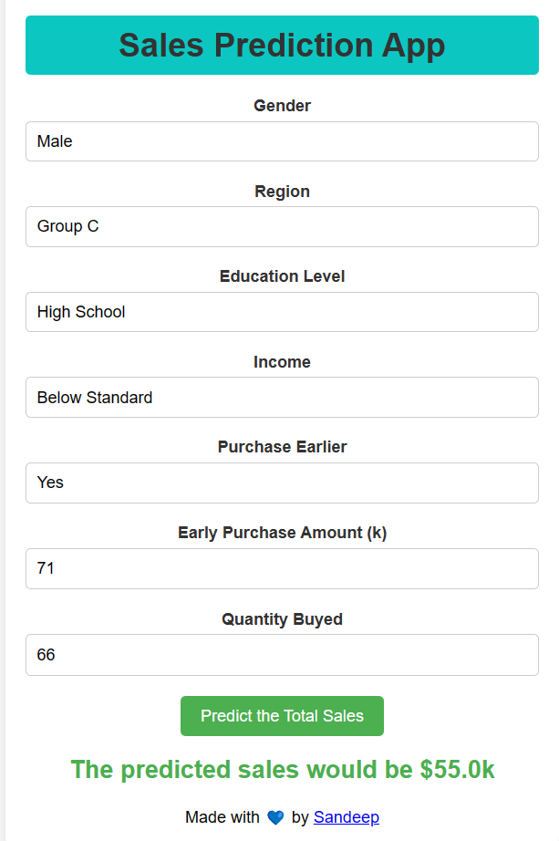

## End to End Machine Learning on Pharmacy Dataset

`Overview`
🚀 Welcome to the Pharmacy Machine Learning Model repository! This project is designed to provide an end-to-end modular coding structure for building and deploying a machine learning model on pharmaceutical data. The application is powered by Flask, providing a seamless and interactive user experience.

`Highlights`
✨ Modular Structure: The codebase is organized into modular components, making it easy to understand, extend, and maintain.

🔍 Exploratory Data Analysis: A comprehensive EDA is performed on the pharmacy dataset, ensuring a thorough understanding of the data before model development.

🛠 Scalable Architecture: The architecture is designed for scalability, allowing the integration of new features and models effortlessly.

🌐 Flask Web Application: Experience the model through a user-friendly web interface powered by Flask, providing real-time predictions.

📈 Model Evaluation Metrics: The model's performance is assessed using key metrics such as accuracy, precision, recall, and F1 score.

`Features`
📊 Data_ingestion: data ingestion pipeline from db or in .csv from local system. 
🤖 Data_transformation: feature scaling and creating transformation pipeline like onehot encoding and imputers. 
📉 model_trainer.py: Train models and validate their performance using cross-validation techniques. 
🚀 Flask Web App: Deploy the model as a Flask web application for easy interaction. 
📠Documentation: Detailed documentation to guide users and developers through the codebase. 
🤖 Github Action: The app has been tested and deployed in Azure cloud using Github Action. 

`Getting Started`

Before you begin, ensure you have the following installed:
Python 3.8
Flask
NumPy, Pandas, Scikit-learn
catboost
xgboost
dill, etc as mentioned.

`Installation`
- Clone the repository.
- pip install the requirements.
- Run the app.py file

`Contributing`
🤝 We welcome contributions! To contribute to this project, please follow our contribution guidelines.

`License`
📄 This project is licensed under the MIT License.

👩‍💻 Start exploring the code, make improvements, and witness the power of Flask in deploying machine learning models. Happy coding! 🚀

`Author`: Sandeep Chowdhury